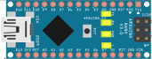
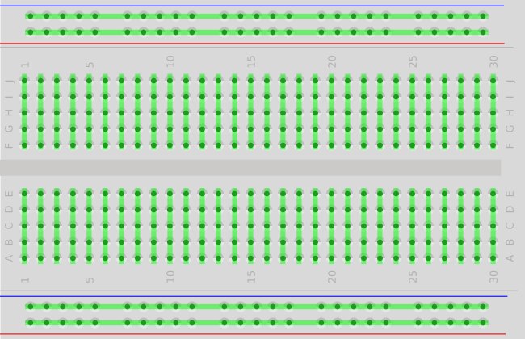
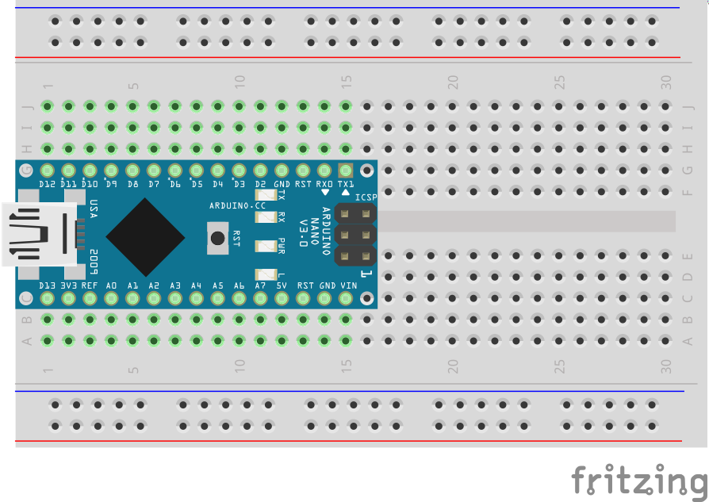
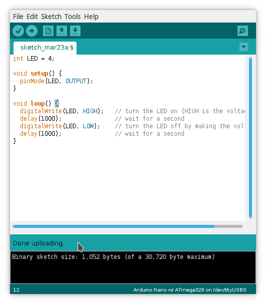
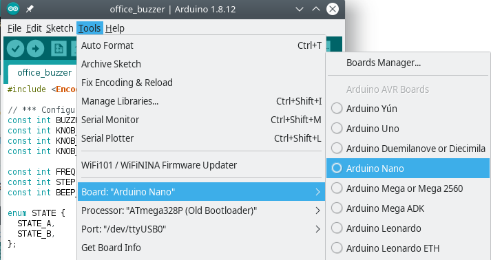

# Week 1: Basic Terminology

This week is the real introduction for everything that's planned for this project. After this week, you'll have everything you need (software and hardware) to start hacking on the Arduino Nano, and can ditch this weekly project and go on your separate way with your own ideas. But you can also stay for a couple more weeks :)

I suggest not to skip this section even if you feel that it's a repetition for you -- skim it quickly instead of skipping. It's always convenient to have a shared terminology.


# Arduino
What is Arduino, and how come a $1 chip, sold in a $20 packaging became so popular?

Arduino is tiny computer used to operate other electrical components (like LEDS, buzzers, motors, etc). In addition to the the Arduino hardware, part of the Arduino project is also the Arduino IDE, providing a simple way to program the hardware.

- Arduino is built for ease of use, not to be the smallest or fastest chip. It allows experimenting with external devices without having to solder anything, plug & play programmable hardware.
- It's open source (very important in hardware), so it's easy to find its spec, build and modify the device and build components for it.
- It comes with a nice [IDE](https://www.arduino.cc/en/Main/Software) that's full of examples for quick star.
- It connects to the computer and powers up from USB, no need for special adapters or trying to attach separate wires anywhere.
- Has many extensions, called shields, to add specific functionality (e.g., many motor controllers, or Bluetooth, etc).
- It fits on a breadboard, which makes it very easy to play with and prototype, without the need to solder (permanently attach) anything. It makes hardware as flexible as software.


### Microcontrollers
A microcontroller is a small programmable computer, it'll usually include a CPU, program memory and a set of controllable input/output appendages.


## Arduino Nano


This is a diagram of the [Arduino Nano board](https://store.arduino.cc/usa/arduino-nano). It has 1 mini-USB connection.


What you see on the board are:
* It middle is the `Atmel ATmega328P` microcontroller, 8-bit RISC processor :smile:
* A reset button
* 4 LEDs (the bright yellow rectangles in the diagram)
  * The bottom one is for general purpose
  * The next one is the power indicator LED
  * The top 2 LEDs are TX/RX (you see them flash when you upload new code)
* Output/input pins
* On the left side of the board, there's a mini-USB connection. It's used both for power and for communication (More about powering up Arduino later).


## Breadboards
A breadboard, is a quick way to connect and test electronics without the need to solder anything. Because it does not require soldering, the board is reusable. For this reason, another common name is prototype board.

All breadboards have the same arrangements and they come in a few different sizes.



The holes in a breadboard are connected among themselves in the following pattern:

On both sides, 2 columns are connected all the way from top to bottom. It's usually used for power and ground, and most breadboards mark them with `-` and `+`.

The internal holes are connected in rows, divided in the middle, such that each row has 2 sets of connected holes: the first 5 holes and the last 5 holes.

In the diagram above, the green lines indicate holes that are connected together.


The Arduino Nano fits into a breadboard, and our projects will all start like this:


### Jumper wires
Jumper wires are the wires with a needle-like tip, these go into the holes of the breadboard to connect different components to the Arduino, and connect the components to power.
Connecting anything on a breadboard with jumper wires utilizes the pre-existing connections of the beardboard: connecting an LED means placing the jumper wire in the same row group (contiguous 5 holes in a row) as the LED leg.


## Arduino IDE
Refer to this list: [Intro/Software Requirements](../Intro.md#software-requirements) and make sure you have both Arduino IDE and the USB driver installed.

Next, open Arduino IDE, make sure you installed the CH340 USB driver.


**Choose the board and the port**

From the `Tools` menu select the `Board` and `Port` for your Arduino.
* Board: Arduino Nano w/ ATmega328P (old bootloader)
* Port: Serial port through USB, depends on the operating system.



Arduino IDE projects are called *sketches*, the suffix for the file is `*.ino`.

Let's get to it!


### Components
- Breadboard
- Arduino Nano
- Mini USB cable

### Circuit Diagram


### Arduino IDE
The Arduino IDE, conveniently comes with a large collection of examples.
For this first project, we'll use an example instead of writing the code ourselves.

In Arduino IDE:

`File` -> `Examples` -> `01. Basics` -> `Blink`


Now upload the code to the Arduino:

`File` -> `Upload`

Or click the :right-arrow: button in the button bar of the IDE.

You should see the generic LED (the bottom LED) start blinking slowly.


### Code
The code of the blink example demonstrates the structure of Arduino programs:

- `void setup` function, that runs when the device powers up
- `void loop` function, that is the main loop of the application

```c
/*
  Blink
  Turns on an LED on for one second, then off for one second, repeatedly.

  This example code is in the public domain.
 */

// Pin 13 has an LED connected on most Arduino boards.
// give it a name:
int led = 13;

// the setup routine runs once when you press reset:
void setup() {
  // initialize the digital pin as an output.
  pinMode(led, OUTPUT);
}

// the loop routine runs over and over again forever:
void loop() {
  digitalWrite(led, HIGH);   // turn the LED on (HIGH is the voltage level)
  delay(1000);               // wait for a second
  digitalWrite(led, LOW);    // turn the LED off by making the voltage LOW
  delay(1000);               // wait for a second
}
```

### Buzzer

Now we'll modify the code and breadboard configuration to make sound with a buzzer


Download the code from [buzzer/buzzer.ino](buzzer).

# Recap
- [ ] What is an Arduino
- [ ] Using a breadboard
- [ ] Using the Arduino IDE
- [ ] Making sounds with a buzzer


## Electronics & Electricity

P = IV

V = IR

Name | Symbol | Unit | Unit Symbol
---- | -------|------|------------
Resistance | R | Ohm | Ω
Current | I | Ampere | A
Voltage | V | Volt | V
Power | P | Watt | W
