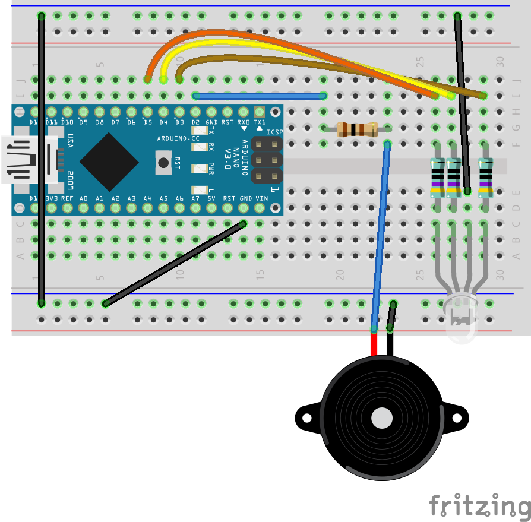

# Playing (Music) with a Buzzer

Today we're going to experiment with the piezo buzzer. First, we'll learn about the buzzer and then learn how to control it with Arduino.

A *piezo buzzer* is a cute and simple element that can generate sound in different frequencies. The sound is generated when current runs through the buzzer and causes its 2 components to vibrate against each other. Different vibration frequencies will generate sound in different pitches.

Based on this description, you see that a buzzer cannot play multiple sounds at a time, nor can it play recordings or real music. Nonetheless, a buzzer is a very useful component and can be a lot of fun. Today we're going to play popular tunes with a buzzer.

> Anecdote: Active buzzers have a sticker on the top, saying "Remove after washing". This refers to the hole they have on the top, and the washing process is what industrial systems do to remove flux residue on the board after soldering and before finishing the production.
> Don't wash it, you can just remove

## Code
The full project is available at [buzzer_tune/buzzer_tune.ino](buzzer_tune).

There are 2 functions to play and mute a buzzer with an Arduino:
- `tone(<buzzer_pin>, <frequency>)`
   There's also a version with 3 arguments: `tone(<buzzer_pin>, <frequency>, <duration>)`, but I tried it on 2 different computers (Linux, Mac) with different versions of Arduino IDE and it never worked as expected, so using the 1st form and adding a `delay(<duration>)` is consistently working.
- `noTone(<buzzer_pin>)`
   This function stops the buzzer from buzzing.

Except for playing different frequencies, you might also want to change the volume

## Components
Generic requirements:

- Breadboard
- Arduino
- mini USB cable
- Jumper wires

Project specific needs:
- 100Ω resistor
- Piezo Buzzer

## Circuit Diagram
Just like last week

## Recap
- [ ] Buzzer mechanics
- [ ] Using built-in functions: `delay` and `tone`
- [ ] Adding multiple files to Arduino project
