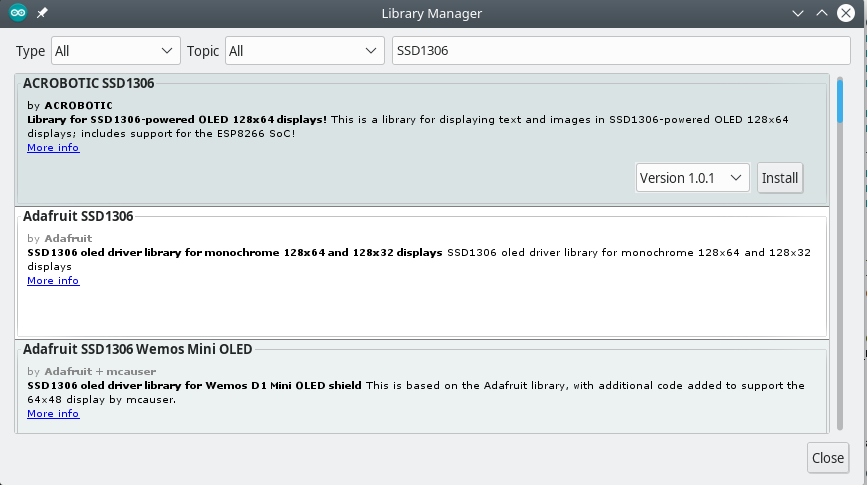
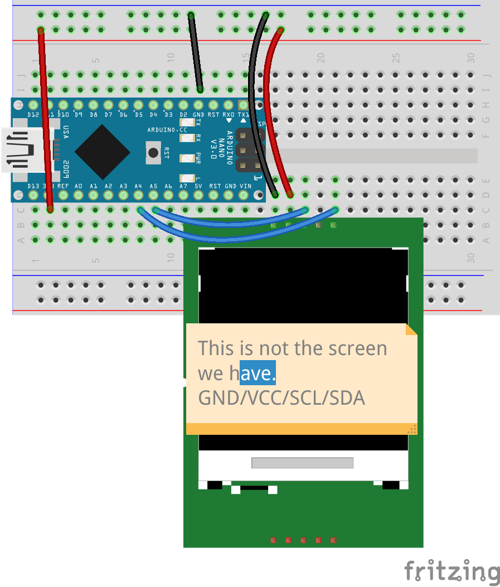
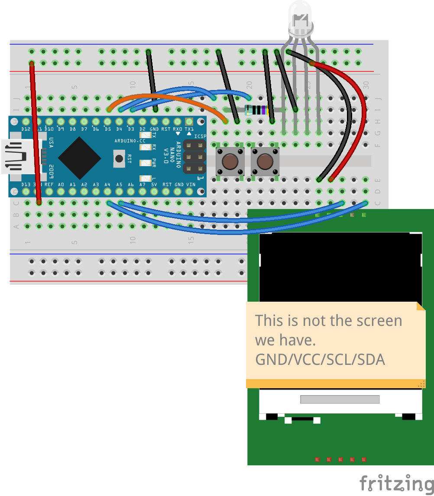

# OLED & Speed Reaction Game
Today we'll make a reaction speed game: the player will need to push a button as fast as possible after an LED light goes off. To make it a bit harder, the player must press a second button, and keep it pressed as long as the LED is on.

To display the time it took the player to push the button, and show the top score we'll use a screen! The screen we have is a 124x64 single color, 1" with SSD1306 driver, with good driver support for Arduino.

The display we have uses a communication technology called I2C (originally developed by Philipis). I2C uses 2 pins for communication: SDA (data) and SCL (clock), in addition to GND (ground) and VCC (voltage) pins. This efficiency in used pins makes it convenient for prototyping with a breadboard. There's a newer protocol called SPI, which requires 4 pins (+ 2 for ground and voltage), and can be 3x faster (or more) than I2C. Our project will not benefit from faster speeds, so we'll enjoy the simplicity of I2C.


## Screen Example
We need a driver to control the screen, we're going to use the most popular one for Arduino: [Adafruit SSD1306 driver and library](https://github.com/adafruit/Adafruit_SSD1306). What's great about this driver is that it comes with a full text and effects library, so it saves us the from the work of coding individual letters, fonts, etc.

Go to `Sketch` -> `Include Libraries` -> `Manage Libraries...` <br />
In the Library Manager window, search for `SSD1306` and install the library by Adafruit.



If it's asking you about dependencies -- select "Install All"


### Screen Example Code
The full project is available at [speed_game/speed_game.ino](speed_game).

The code of the example project is horribly copied from the [Adafruit example code](https://github.com/adafruit/Adafruit_SSD1306/tree/master/examples/ssd1306_128x64_i2c) with the minor difference of changing some of the Adafruit logo animation into Coronavirus animation.


### Screen Example Componets
Generic requirements:
- Breadboard
- Arduino
- mini USB cable
- Jumper wires

Project specific needs:
- 4-pin I2C LCD


### Screen Example Circuit Diagram


Using the default binding of SDA (data) and SCL (clock) pins, we need to connect the SDA to A4 and SCL to A5 on Arduino.


## Code
The full code  project is available at [office_buzzer/office_buzzzer.ino](office_buzzer).

There's something interesting we're doing with our code this time: using the `PROGMEM` directive. <br />

### Arduino Memory
Arduino Nano is powered by ATmega328(P) microcontroller. This chip has 3 pools of memory:
- 32KB flash
- 1KB EEPROM
- 2KB SRAM

The **flash memory** is non volotile (will not erease after the device is powered down), and this is where the program code is stored.<br />
**EEPROM** is non volatile store that can be accessed (for R&W) during program execution. This is the place where parameters and settinsg can be stored, e.g., highest score for a game, last-use-time, and such.<br />
SRAM is the random access memory on Arduino. It's volotile -- it clears when the chip loses power. The S in SRAM stands for Static, which means that there's no extra work needed to "keep" the bits stored in SRAM after they were written. This in contrast to DRAM (the most common and biggest variant of RAM in computers), where D stands for Dynamic, which means that the memory controller needs to continuously refresh the units to make sure memory is not "erased". DRAM is cheaper and easier to make in larger sizes while SRAM is more expensive and is not available in lange sizes. SRAM is also more power efficient, because there's no need to continuously refresh it.


The RAM is used for all dynamic memory allocation of applications running on Arduino. Sometimes, you have data that's static and won't change during the runtime of the application, this is where the `PROGMEM` directive comes in handy. It stores program data in flash memory, together with program code, instead of in SRAM.

```c
// The variables marked as PROGMEM have to be const
// otherwise they can be dynamically changed
const unsigned char PROGMEM button[] = {
 // content of the array
};
```
Reading data from flash memory is not the same as accessing a normal array. This is done using the `pgmspace.h` library, with all the functions starting with `pgm_ream_` e.g.,:

```c
#include <avr/pgmspace.h>

pgm_read_byte(button + 2); // for example
```

In this project we have graphics (bitmaps for the screen) that are stored as byte arrays, and we're using the `PROGMEM` directive to store them in the flash memory, together with the application. A very common use case.

## Components
Generic requirements:
- Breadboard
- Arduino
- mini USB cable
- Jumper wires

Project specific needs:
- 4-pin I2C LCD
- LED (or RGB LED)
- Resistors for LED

## Circuit Diagram


This is meant to be extended from the screen example above, so all it takes is wiring 2 buttons and an LED

## Recap
- [ ] Screen usage and protocols
- [ ] PROGMEM directive

## Extra Credit
- [ ] Store the highest score in EEPROM
- [ ] Add an opening "game rules" screen

