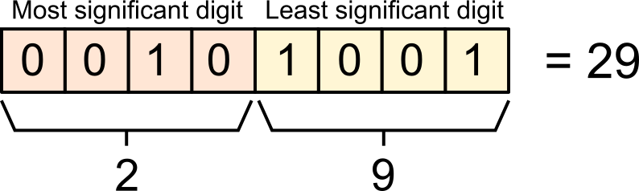

# Real Time Clock with Temperature Logger
This week we're going to make a temperature logger for the hot days ahead of us. We need data to complain more effectively about the weather, and this is exactly what we're going to get: we'll be logging the all-time high, all-time low temperatures and daily highs and lows, and the times/dates in point.

To know the time and temperature we'll use a new component! The Real Time Clock (RTC) module that has a temperature component as well, the DS3231.

## RTC Example
In this example, we'll use I2C wire protocol to communicate with the RTC. It's going to be low level, bare-bones work of communicating with a component, without the libraries that make this work nicer. The goal is to show that although it's very low level, it's not complicated, and libraries provide nice abstractions, but there's no magic there.

For this examples, no new libraries are needed.

### Code
The full project is available at [rtc_example](rtc_example/rtc_example.ino).

To understand how to communicate with DS3231 RTC we can look at [its datasheet](https://datasheets.maximintegrated.com/en/ds/DS3231M.pdf). The datasheet specifies the "API" for the component, and other information that allow users to use it effectively and in its correct environment and setting (e.g., our component should not be used above 85℃, so it's not suitable as an oven thermometer).

DS3231 has 20 registers we can read and write. I'll give a partial address table here, and a full table is available in the datasheet.

| Address | Bits 7 - 4      | Bits 3 - 0 | Function | Range                   |
|---------|-----------------|------------|----------|-------------------------|
| 0x00    | 10 sec          | sec        | Seconds  | 0-59                    |
| 0x01    | 10 min          | min        | Minutes  | 0-59                    |
| 0x02    | AM/PM + 10 hour | hour       | Hours    | 1-12 & AM/PM<br/> 00-23 |

And so on, all the way to 0x12.<br />
Most of the registers are or date time and temperature data, but some are used for control and status, like whether the device was reset (lost power), whether alarms are set, etc.


#### I2C
Let's look at this simple code that connects and reads a byte.


```c
#include <Wire.h>

void setup() {
    Serial.begin(9600);

    // Initialize I2C bus
    Wire.begin();

    byte minutes_address = 0x01;

    // Reading a byte
    Wire.beginTransmission(0x68); // device address on I2C bus
    Wire.write(minutes_address);  // The register to read
    Wire.endTransmission(false);
    Wire.requestFrom(0x68, (byte)1);

    byte res = Wire.read();
    Serial.println(res, BIN);
}

void loop() {
}
```

This short sketch sets up the I2C bus in the line `Wire.begin();`, and then starts communicating with a device addressed on `0x68`. I2C is a compact and powerful protocol, the same bus can be used to communicate with multiple devices, each identified by a unique address (Note: the address space is a single byte, so up to 127 devices on a bus).

The rest of the code tells the device the address we want to read, and how many bytes to read from that address. We then read the byte we requested and then assigns the result to a local variable.

#### Binary-Coded Decimal
When we read data from a device we need to know how to parse the bytes we get. From the RTC datasheet, we know that RTC stores time data as Binary-coded decimal (BCD) format.



BCD encodes each digit of a decimal number in a constant number of bits. A common configuration is to use 4 bits for a single digit, so 1 byte for a 2-digit decimal number.<br />
The image above demonstrates how we're going to read and parse numeric values.

```c
/**
 * Send the given decimal number over the wire interface as BCD
 * Works only for byte size -- 2 digit numbers 0-99
 */
void wire_as_bcd(byte num) {
  byte bcd = ((num / 10) << 4) + num % 10;
  bcd &= 0xFF;
  Wire.write(bcd);
}

/**
 * Read from wire and convert BCD to decimal.
 * Works for 2-digit numbers (0-99), encoded in a single byte.
 */
byte read_byte_as_dec(){
  byte num = Wire.read();
  return (num & 0x0F) + ((num >> 4) * 10);
}
```

The code above is an example of parsing to- and from BCD.


### RTC Example Components
Generic requirements:
- Breadboard
- Arduino
- mini USB cable
- Jumper wires

Project specific needs:
- DS3231 Real time clock component

### RTC Example Circuit Diagram


The RTC module in the diagram is not the same as our module, the wirings to the labels should be correct.

# Temperature Logger
The code is a small extension to [RTC Example above](rtc_example/rtc_example.ino).

The wiring is exactly the same, but we'll need to upload a new sketch that stores the high/low points of temperature during its operation.
<br />We'll output everything to the Serial Monitor, like so:

```
Now: 27.50C
Recorded max: 34.50C (03/06/20 15:51:20), recorded min: 22.25C (30/05/20 06:57:46)
```

## Code
The full code  project is available at [temp_logger](temp_logger/temp_logger.ino).

An interesting thing to notice here is the different way of reading the temperature values and the clock values from the component: time is stored in BCD format, but temperature has normal binary encoding, with 2 components: MSB (most significant byte) and LSB (least significant byte). The LSB in this case is used to decimal points -- the module we have has a temperature granularity of up to 0.25C

```
// Start a request to device on 0x68
Wire.beginTransmission(0x68);  // address of device
Wire.write(0x11);              // address of register to read
Wire.endTransmission(false);
Wire.requestFrom(0x68, 2);     // how many bytes to read

// read 2 parts of the temperature
byte temperature_msb = Wire.read();
byte temperature_lsb = Wire.read();
temperature = (float)temperature_msb + (temperature_lsb >> 6) * 0.25f;
```

# Extra Credit
- [ ] Write the logged max/min temperature to EEPROM.
- [ ] Reset the values every day, to have a daily min/max temperatures
- [ ] Convert to ℉, if so you desire
