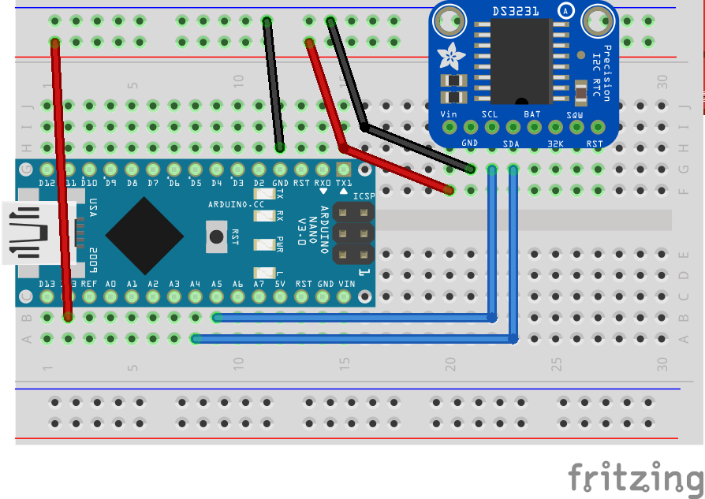

# Real Time Clock with Watch Faces
This week we're going to make a Pebble clone! We're going to build a watch with a nice screen and interchangeable watch faces.

Every watch needs a screen, which we already used in [week5](../week5), but a watch also needs a component that can do accurate timekeeping. Our new component this week is a Real Time Clock (RTC) DS3231.


## RTC Example
In this example, we'll use I2C wire protocol to communicate with the RTC. It's going to be low level, bare-bones work of communicating with a component, without the libraries that make this work nicer. The goal is to show that although it's very low level, it's not complicated, and libraries provide nice abstractions, but no magic happens there.

For this examples, no new libraries are needed.

### Code
The full project is available at [rtc_example](rtc_example/rtc_example.ino).

To understand how to communicate with DS3231 RTC we can look at [its datasheet](https://datasheets.maximintegrated.com/en/ds/DS3231M.pdf). The datasheet specifies the "API" for the component, and other information that allow users to use it effectively and in its correct environment and setting (e.g., our component should not be used above 85℃, so it's not suitable as oven thermometer).

DS3231 has 20 registers we can read and write. I'll give a partial address table here, and a full table is available in the datasheet.

| Address | Bits 7 - 4      | Bits 3 - 0 | Function | Range                   |
|---------|-----------------|------------|----------|-------------------------|
| 0x00    | 10 sec          | sec        | Seconds  | 0-59                    |
| 0x01    | 10 min          | min        | Minutes  | 0-59                    |
| 0x02    | AM/PM + 10 hour | hour       | Hours    | 1-12 & AM/PM<br/> 00-23 |

And so on, all the way to 0x12.<br />
Most of the registers are or date time and temperature data, but some are used for control and status, like whether the device was reset (lost power), whether alarms are set, etc.


#### I2C
Let's look at this simple code that connects and reads a byte.


```c
#include <Wire.h>

void setup() {
    Serial.begin(9600);

    // Initialize I2C bus
    Wire.begin();

    byte minutes_address = 0x01;

    // Reading a byte
    Wire.beginTransmission(0x68);
    Wire.write(minutes_address);  // The register to read
    Wire.endTransmission(false);
    Wire.requestFrom(0x68, (byte)1);

    byte res = Wire.read();
    Serial.println(res, BIN);
}

void loop() {
}
```

This short sketch sets up the I2C bus in the line `Wire.begin();`, and then starts communicating with a device addressed on `0x68`. I2C is a compact and powerful protocol, the same bus can be used to communicate with multiple devices, each identified by a unique address (Note: the address space is a single byte, so up to 127 devices on a bus).

The rest of the code tells the device the address we want to read, and how many bytes to read from that address. We then read the byte we requested and then assigns the result to a local variable.

#### Binary-Coded Decimal
When we read data from a device we need to know how to parse the bytes we get. From the RTC datasheet, we know that RTC stores data as Binary-coded decimal (BCD) format.


BCD encodes each digit of a decimal number in a constant number of bits. A common configuration is to use 4 bits for a single digit, so 1 byte for a 2-digit decimal number.<br />
The image above demonstrates how we're going to read and parse numeric values.

```c
/**
 * Send the given decimal number over the wire interface as BCD
 * Works only for byte size -- 2 digit numbers 0-99
 */
void wire_as_bcd(byte num) {
  byte bcd = ((num / 10) << 4) + num % 10;
  bcd &= 0xFF;
  Wire.write(bcd);
}

/**
 * Read from wire and convert BCD to decimal.
 * Works for 2-digit numbers (0-99), encoded in a single byte.
 */
byte read_byte_as_dec(){
  byte num = Wire.read();
  return (num & 0x0F) + ((num >> 4) * 10);
}
```

The code above is an example of parsing to- and from BCD.


### RTC Example Components
Generic requirements:
- Breadboard
- Arduino
- mini USB cable
- Jumper wires

Project specific needs:
- DS3231 Real time clock component

### RTC Example Circuit Diagram


## Code
The full code  project is available at [rtc_watch](rtc_watch/rtc_watch.ino).

Now that we know how to directly work with RTC through I2C protocol, we can skip this part and use a nice library. We'll be using the `RTClib` from Adafruit.

Go to `Sketch` -> `Include Libraries` -> `Manage Libraries...` <br />
In the Library Manager window, search for `RTClib` and install the library by Adafruit.


The work with the new library is very simple:

```c
// Declare
RTC_DS3231 rtc;

// initialize
rtc.begin();

// use
DateTime now = rtc.now();
```

The rest of the code is dealing with the display, and updating and placing the numeric values in the appropriate places for each watch face.

Notice how both the RCT and screen connected to the same SDA (data) and SCL (clock) pins. This is our I2C bus, and each component on the bus has a unique address. We can connect a monitor and real time clock, but won't be able to connect 2 of the same monitors in the same way -- since the addresses collide.


## Real Time Clock components
Generic requirements:
- Breadboard
- Arduino
- mini USB cable
- Jumper wires

Project specific needs:
- DS3231 Real time clock component
- SSD1306 128x64 I2C screen


## Real Time Clock Watch Faces Circuit Diagram


## Recap
- Binary-coded decimals
- Direct communication with a component, reading and writing (correctly coded) bytes
- Using multiple components on the same I2C bus

## Extra Credit
- [ ] Build your own watch face

## My TODOS
- [ ] Add editing mode
- [ ] Watch face switching with rotary encoder
