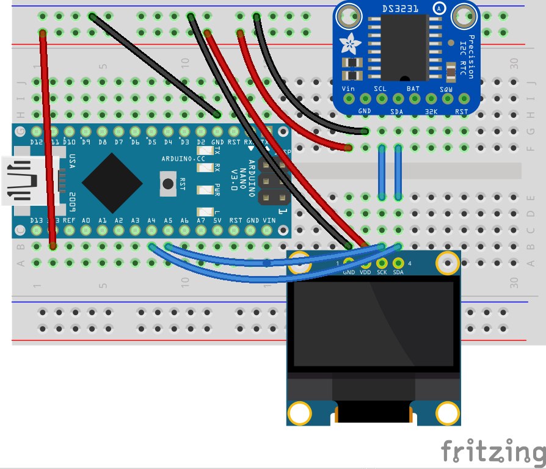

# Real Time Clock with Temperature Logger and a Screen
This is a small extension of the [previous project](../week6). We're going to add an LCD to our temperature logger to display the logged temporatures and current time and temperature.


Today's project will have a new construction we haven't done before -- connecting multiple devices to the same lines. This is how we're going to use the I2C bus with 2 devices: OLED and RTC.


# Temperature Logger V2
We're adding a screen to our [temperature logger](../week6) to show all the values we've collected. In addition to temperature, we'll make the display useful by also showing the current time in the center. The 4 corners are used to show daily highs and lows and all time high & low temperatures.

The code is a small extension to [week6's project](../week6), and can be found in [temp_logger_v2](temp_logger_v2/temp_logger_v2.ino).

The wiring remains the same, with the addition of a screen that needs to connect to `A4`, `A5` on Arduino and power/ground.

Serial monitor is now used mostly for logging and not as the main display for the gathered information.

### Placing Text on Screen
To show text on the screen, the display library needs to take the text to display and draw the pixels, one by one, in the screen memory so our text is displayed.
Like in text editors, when we have a selection of properties like font, size and attributes, the same goes for the display library. The values in each of these properties affects how the screen memory is updated.

Our code starts with setting the text size and to say whether we want white-on-black or black-on-white
```
display.setTextSize(1);
display.setTextColor(WHITE, BLACK);
```

Static text placement

```c
display.setCursor(0, 0);
display.print(F("Hello"));
```
This will print the word "Hello" at the top left corder of the screen.

But sometimes, we'd like to be centered, or aligned right, so setting it's top,left position is not enough.
For this, we can use the method `getTextBounds` that will give us the bounding box of the given string.

```c
int16_t  x1, y1;
uint16_t w, h;

display.getTextBounds(F("Hello"), 0, 0, &x1, &y1, &w, &h);
display.setCursor(SCREEN_WIDTH - w, 0);
display.print(F("Hello"));
```
This will print the word "Hello" at the top of the screen, perfectly aligned to the right.


## RTC Example Components
Generic requirements:
- Breadboard
- Arduino
- mini USB cable
- Jumper wires

Project specific needs:
- DS3231 Real time clock component
- SSD1306 OLED screen 128x64

## Temperature Logger V2 Circuit Diagram


I finally have the correct OLED part for diagrams! Looks so much prettier.

# Extra Credit
- [ ] Make it pretty!
