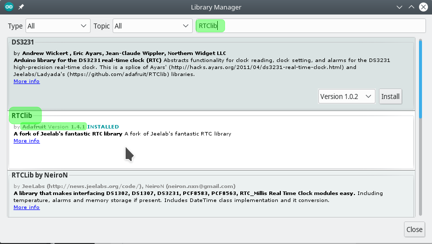
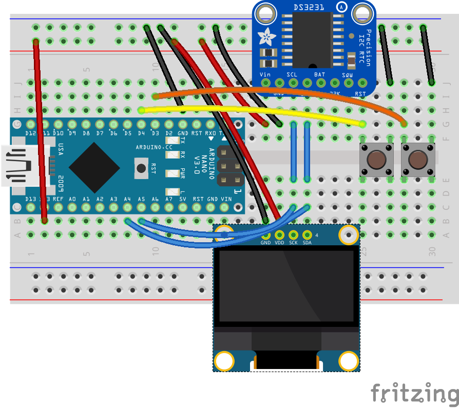

# Casio Clone ⌚
Today we'll continue building on past projects, and implement an even nicer watch. This time we'll build a full wrist watch, one that can be adjusted with the buttons on the watch instead of having to recompile and upload the code again.

If you're familiar with digital wrist watches (like Casio!), you'll find it very easy to adjust our watch: press one button to move between the fields to adjust and the second button used to increase (and roll) the value until you're happy with the value.

The circuit from last week is not changing much, but you might have to change the position of the screen and RTC to place the new components today.

## Code
The full project is available at [casio_clone](casio_clone/casio_clone.ino)

Now that we know how to interact with RTC directly through I2C protocol, we can skip this part and use a nice library that does it for us. We'll be using the `RTClib` from Adafruit.

Go to `Sketch` -> `Include Libraries` -> `Manage Libraries...` <br />
In the Library Manager window, search for `RTClib` and install the library by Adafruit.



Working with the new library is very simple:

```c
// Declare
RTC_DS3231 rtc;

// initialize
rtc.begin();

// use
DateTime now = rtc.now();
```

We also have a special directive in the code: `#if` to conditionally define how the date formatting should be like.

```c
#define US_FORMAT 0

#if US_FORMAT
// code path for US date and time formats
#endif
#if !US_FORMAT
// code path for standard date and time formats
#endif
```

## Components
Generic requirements:
- Breadboard
- Arduino
- mini USB cable
- Jumper wires

Project specific needs:
- DS3231 Real time clock component
- SSD1306 OLED screen 128x64
- 2x push buttons

## Circuit Diagram



## Extra Credit
- [ ] Change the watch face
- [ ] Add a timer and a stopper
